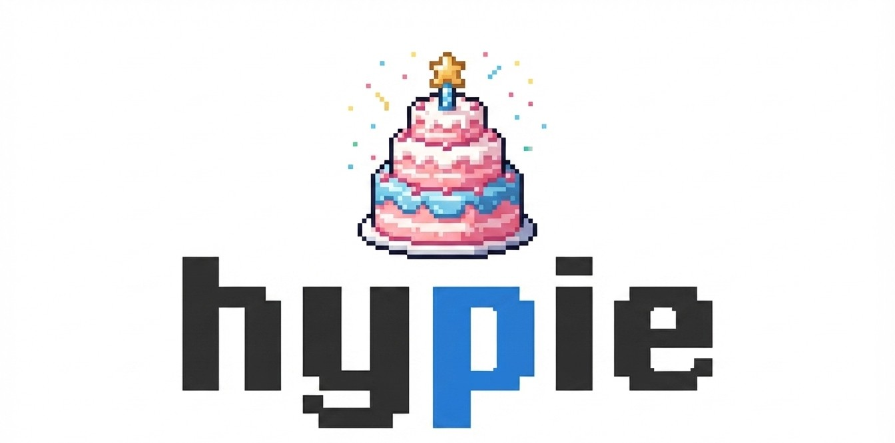
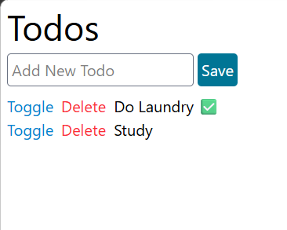
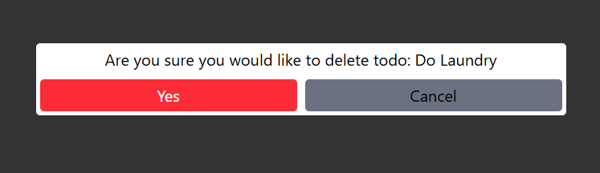

<p align="center">
    
</p>

<!-- # Hypie -->
## Intro
Hypie, pronounced "high-pie", is a python library for building web frontends, built on top of [_hyperscript](https://github.com/bigskysoftware/_hyperscript), a scripting language for the web made by the [htmx](https://github.com/bigskysoftware/htmx) folks, and [htpy](https://github.com/pelme/htpy), a library for generating HTML in python.  

Right now Hypie is a personal passion side project that is still very experimental. Expect breaking changes.

There is no official docs website for hypie (yet), so this README is the closest thing to a documentation for now, if you are interested, I would advise reading through the whole thing, hopefully its not too long.

## Installation
```sh
uv add hypie
```  
Or if you are from ancient times  
```sh
pip install hypie
```

## Motivation
I like coding in python, I hate coding in javascript (although sometimes it is inevitable), and I find the current frontend ecosystem extremely complex and messy, more so when using the so called "metaframeworks". Like many other people who share the same frustration, this motivated a bunch of attempts to create simpler alternatives that revive more traditional (and simpler) ideas with a modern look, like [_hyperscript](https://github.com/bigskysoftware/_hyperscript) and [htmx](https://github.com/bigskysoftware/htmx), and even within the python ecosystem, like [FastHTML](https://github.com/answerdotai/fasthtml). Hypie is one of those attempts, built on top of _hyperscript and htpy.  

With hypie the goal is to be able to write powerful frontends, using python, that is backend agnostic (you can use whatever python backend framework you like), using relatively little and hopefully clear abstractions, powered by _hyperscript's [commands and features](https://hyperscript.org/docs/language/).

The way Hypie pushes you to think about frontend system is as follows:  
- Server generates HTML "Components" and returns it as a response
- "Components" should be, for the most part, purely presentational  
- "Components" should emit semantically meaningful events, they should not contain logic that does side effects or is aware of other parts of the system, "Behavioural" parts of the system can handle emitted events, cause all kinds of side effects and is aware of the different components and parts of the system.
- If you need to generate HTML from the client that does not need a server trip (i.e. a visual component that does not rely on any kind of data from the server), like a Modal, you can define a "Template" that you can render anywhere, client side, no server roundtrips.  

Before diving into hypie, it is useful to take a very quick look at the two main technologies hypie relies on, htpy and _hyperscript, all examples will assume a fastapi backend, but it should work with **any** python backend framework.
## Htpy and Hyperscript primers
### Htpy
[htpy](https://github.com/pelme/htpy) is a python library for writing html, it is essentially a pythonic answer to templating languages.
```python
import htpy

my_element = htpy.div(id="my-div", class_="some-class")[
    htpy.h1["Some Title"],
    htpy.p["some text"],
    htpy.div[
        htpy.a(href="/some/site")["click me!"]
    ]
]
```
This is equivalent to:
```html
<div id="my-div" class="some-class">
    <h1>Some Title</h1>
    <p>some text</p>
    <div>
        <a href="/some/site">click me!</a>
    </div>
</div>
```
Htpy makes a distinction between parenthesis and square brackets, you put element attributes in parenthesis as keyword arguments, and you put the actual children/content in square brackets, at first this might look a bit weird, but it is actually a very nice way to represent html in python and makes scanning the code easier once you get used to it.  
You can then return htpy elements as HTML responses in your favourite backend framework.
```python
import htpy
from fastapi import FastAPI
from fastapi.responses import HTMLResponse

app = FastAPI()

@app.get("/")
def home():
    return HTMLResponse(
        htpy.h1["Hello World!"]
    )
```

### _Hyperscript
[_hyperscript](https://github.com/bigskysoftware/_hyperscript) is a scripting language that can be embedded directly in HTML, here is an example:  
```html
<button _="
on click 
    toggle .red on me
end
">
  Click Me
</button>
```
This is a button, when you click it, you add (or remove) the .red class, you "toggle" the .red class, you probably inferred this already, what I just explained did not add much to what was written already.  
Hyperscript is meant to be very readable, someone can easily take a look at your html and understand what is going on, even if they are not familiar with the language, because it reads like English (more on this later, because I can see the crossing eyebrows), let's quickly dissect _hypersrcipt syntax.  
On the element you want to add behaviour to, you basically set the underscore attribute ("_") to the _hyperscript you want.  

_Hyperscript syntax is made up of three main components:
- Features (like the `on [EVENT]` features you saw, and other likes `init`, `live` and more)
- Commands (like `toggle`, `log`, `add`, `remove`, `put` and more)
- Expressions (like literals `"hello"`, `1`, `5+3`, dom literals like `#my-div`, `.my-class` and more)

So, in general, _hyperscript code looks like this:
```html
<element _="
FEATURE 1
    COMMAND 1 
    COMMAND 2
    ...
    COMMAND N
end

FEATURE 2
    COMMAND 1
    COMMAND 2
    ...
    COMMAND N
end

...

FEATURE N
    ...
end
">
</element>
```
You can technically inline stuff and remove the `end` keyword in many scenarios, but I tend to keep things that way to keep everything readable, going back to the original example, `on` is a feature, that takes a required `event` argument (technically an `event-spec`, not just the name, but we kept everything to its default values, you can control lots of stuff around the event, like its count, debouncing and [tons of other stuff](https://hyperscript.org/features/on/)), `toggle` is a command that takes "two" arguments, `toggle <expr> on <expr>`, and `.red` is a class literal, and `me` is a special literal that refers to the current element (the one that has _hyperscript defined on).  
A full treatment of _hyperscript capabilities is beyond this readme/docs, so you really should check the docs and learn more about the different features, commands and expressions, because hypie is just a layer on top of _hyperscript.

### Htpy + _Hyperscript
Now, with htpy and _hyperscript, you can combine both and do something like this:
```python
import htpy

htpy.button(_="""
on click
    toggle .red on me
end
""")[
    "Click Me"
]
```
This is already pretty useful, and I actually developed using these kind of htpy+_hyperscript elements for a while, but as the project started to get more complex, things started to get a bit messy for the following reasons:
- _Hyperscript as pure strings in python is really fragile, no syntax highlighting, and dynamically adding or removing commands from features is really  ugly
- _Hyperscript's English like syntax is sometimes a bit hard to work with, as some commands have special keywords and variations that you need to remember, i.e hyperscript is easy to read but sometimes a bit difficult to write, it reads like English, but not everything that can be written as English works (even it makes sense, English wise)

For those reasons, I decided to create a python DSL on top of _hyperscript, this allows me to do the following:
```python
import htpy

# instead of 
htpy.button(_="""
on click
    log "I was clicked!"
    toggle .red on me
end
""")[
    "Click Me"
]

# you do
from hypie.literals import var, cls, me
from hypie.commands import log, toggle
from hypie.features import On

htpy.button(_=On("click")[
    log("I was clicked!"),
    toggle(cls("red"), on=me)
])[
    "Click Me"
]
```
That way you get IDE support for the arguments the different commands support, you do not deal with messy strings anymore, and the English issue is gone. Again, this is already helpful, but we can take it a step further, taking inspiration from how components look in frameworks like [Vue](https://github.com/vuejs/core) and [Svelte](https://github.com/sveltejs/svelte), a hypie component is as follows:

### Hypie
```python
from hypie.literals import var, cls
from hypie.commands import log, toggle
from hypie.featuers import On
from hypie.experimental.components import Component

class MyButton(Component):
    def template(self):
        return htpy.button(_=On("click")[
                log("I was clicked!"),
                toggle(cls("red"), on=var("me"))
            ])["Click Me"]

    @staticmethod
    def style():
        return {
            ".red": {
                "background": "red"
            }
        }
```

Hypie Components work with htpy seamlessly, you can do:
```python
htpy.div[
    MyButton # or MyButton() both work,
]
```
and it will work as expected.  

Styles are bound to the component that defined it only, using css scopes, obviously the style won't take effect unless you inline it or generate a css file to link, to generate the styles you need to run the following command:  

```sh
hypie build -i <path/to/components/dir> -o <path/to/dist_or_static/dir>
``` 


This command will go through all python files in the dir and extract the components, and generate a single css file with all the scoped css of the components, you would usually make the `-o` dir be the static dir or dist dir, sadly escaping a build step is difficult if you want to make the library backend agnostic, without inlining the styles. As you will see later, the build step is not only used for generating css files, but can be used to also generate _hyperscript files when moving behvaioural logic out of components, more on that later! Note that `style` is a static method (class method works too), because its expected to run at build time, without instantiating the class.  
The output css file looks like this:
```css
/* ./app/static/_hypie_styles.css */

@scope (button[data-hypie-component='my-button']) {
  .red {
    background-color: red;
  }

}
```
Behind the scenes, hypie adds a `data-hypie-component=<kebab-case-component_name>` attrbitue to the top-level element, the generated css uses that to scope the styles.

Let's move on to other examples and introduce more capabilities and abstractions as we go.

## Simple Counter Example using Hypie
Let's create a very basic Counter Component using hypie.
```python
# ui/components.py
class Counter(Component):
    initial_count: int = 0

    def template(self):
        count_var = var(":count")

        return htpy.div[
            htpy.button(
                _=hs(
                    set_(count_var, to=self.initial_count),
                    On("click")[
                        set_(count_var, to=count_var + 1),
                        set_(var("me").textContent, to=f"Count is: {count_var}"),
                    ],
                )
            )[f"Count is: {self.initial_count}"]
        ]

    @staticmethod
    def style():
        return {
            "button": {
                "background-color": "#4A90D9",
                "color": "#ffffff",
                "border": "none",
                "border-radius": "6px",
                "padding": "10px 20px",
                "font-size": "16px",
                "font-weight": "600",
                "cursor": "pointer",
                "transition": "background-color 0.2s ease",
            },
            "button:hover": {"background-color": "#3A7BC8"},
        }
```
- There are two new additions here, first, there is the `initial_count` class/instance variable, like dataclasses, you can pass different values to `initial_count` when instantiating the class, you can think of these as `props` in other UI frameworks.
- the `hs` function collects several features together (in this case, `On` and `set_`)

So how does this Counter component works? When it first runs, it sets the a variable called `:count` to initial_count (default is 0, or whatever you have passed when you created Counter), and when a click happens, it increments `:count` and puts the text `f"Count is: {count_var}"` into its textContent, that's it.  
The `:` prefix before the variable signals _hyperscript that this is an `element scoped` variable, in hyperscript you can scope variables to be `local (count)`, `element (:count)`, `dom (^count)`, or `global ($count)`, because we needed access to this element across two different features, set_ and On, we made it element scoped, [more here](https://hyperscript.org/docs/language/#scoping). 

Note: set_ can be used as a feature or command.
```python
On(click)[
    # used as a command inside a feature
    set_(var("test"), to="something")
]

hs(
    # used as a feature
    set_(var(":test"), to="something"),
    On("click")[
        ...
    ]
)
```

It is also worth noting this part `f"Count is: {count_var}"`, we are using f-strings with `count_var`, which is a _hyperscript expression, that only makes sense in the client, hypie allows you to use f-strings as if you are working with normal python objects, and it will do the right thing behind the scenes, for example, `f"Count is: {count_var}"` is rendered as ``` `Count is: ${:count}` ```, this might look magical but it makes interpolating _hyperscript expressions much easier, and hypie will deal with it behind the scenes.

Now you might be tempted to create an endpoint and return the Counter, but this won't work yet, hypie is super minimal, you are just returning HTML at the end of the day, we haven't yet created a Layout component that adds _hyperscript and our css (once we build our component to generate that), so lets do this:  

First, let's build our css  
`hypie build -i ./app/ui -o ./app/static`  
And then, let's define a Layout component that encapsulates everything.
```python
# /ui/components.py
class Layout(Component):
    def template(self):
        return htpy.html[
            htpy.head[
                htpy.title["Counter"],
                htpy.link(rel="stylesheet", href="/static/_hypie_styles.css"),
                # _hyperscript
                htpy.script(src="https://cdn.jsdelivr.net/npm/hyperscript.org@0.9.93"),
            ],
            htpy.body[self.children],
        ]
```
Something you might have noticed is `self.children`, this allows us to do stuff like this:
```python
Layout[
    # this goes into self.children
    div[
        h1["Title"],
        p["Random text"],
        Counter(1)
    ]
]
```
Okay, now we can create our endpoints
```python
# main.py
import pathlib
from fastapi import FastAPI
from fastapi.staticfiles import StaticFiles
from fastapi.responses import HTMLResponse
from .ui.components import Layout, Counter

app = FastAPI()

app.mount(
    "/static", StaticFiles(directory=pathlib.Path(__file__).parent.resolve() / "static")
)

@app.get("/")
def counter_example():
    return HTMLResponse(
        Layout[
            Counter(5)
        ]
    )
```

You can now run the app and see the blue counter button.  
Reminder: We are using FastAPI here but this works with any backend framework! just adjust the code based on your framework's abstractions.
## Todo app Example using Hypie
Let's move on to a more interesting example, a classic Todo app, inspired by the Todo app done in this [FastHTML tutorial](https://www.youtube.com/watch?v=Auqrm7WFc0I).

Our end result should look like this:  

  
We are going to do two passes in this example, the first pass will give us a working app, the second pass will introduce new abstractions that allows us to refactor the code to reduce dependencies between components, both apps will be identical functionality wise, just one will be much easier to maintain and extend, let's start with the first pass.

### Pass One: Working App
We can see 5 major UI components:
 - Layout
 - Header
 - Add Todo Form
 - Todo Item

Let's start with the simplest components, Layout and Header, as both are purely presentational
 ```python
 # /ui/components.py
 class Layout(Component):
    def template(self):
        return htpy.fragment[
            htpy.link(rel="stylesheet", href="/static/tw_styles.css"),
            htpy.title["Todos"],
            # _hyperscript
            htpy.script(src="https://cdn.jsdelivr.net/npm/hyperscript.org@0.9.93"),
            htpy.body(class_="flex flex-col gap-2 p-2")[self.children],
        ]

class TodosPageHeader(Component):
    def template(self):
        return htpy.h1(class_="text-4xl")["Todos"]
 ```
 Nothing too interesting or new beside the fact that we are using tailwind here, we obviously have to compile this tailwind into a css file before returning this html from our endpoints, if you have `tailwindcss` installed you can do the following:
create a file named `input.css` in the same dir as your components, with the following contents:
```css
@import "tailwindcss";
@source ".";
```
and then run:  
`tailwindcss -i ./app/ui/input.css -o ./app/static/tw_styles.css`  
This will scan your files in `@source` and any tailwind class found will be registered, the output then goes to `-o` dir, you can also add a `--watch` argument to avoid re-running the command everytime you make a change.

Let's move to the next component, TodoItem.  
A TodoItem can be toggled or deleted, let's first focus on toggling and then discuss deleting after that.

```python
import hypie.literals as hp_literals
from hypie.commands import fetch, morph

class TodoItem(Component):
    id: int
    title: str
    done: bool

    def template(self):
        return htpy.li(id=f"todo-{self.id}", class_="flex gap-2")[
            htpy.a(
                class_="text-sky-600 cursor-pointer select-none",
                _=On("click")[fetch(
                    f"/toggle/{self.id}",
                    with_={"method": "PATCH"},
                    as_="HTML",
                ),
                morph(
                    hp_literals.id(f"todo-{self.id}"),
                    to=hp_literals.result,
                ),],
            )["Toggle"],
            htpy.a(
                class_="text-red-500 cursor-pointer select-none"
            )["Delete"],
            htpy.span[self.title + (" ✅" if self.done else "")],
        ]
```
This implementation only handles toggling, the Delete button does not have any _hypserscript attached to it (hence, it does nothing when clicked), when you click the "Toggle" button, the `fetch` command runs, it sends a request to `/toggle/{self.id}`, sets the request method to `PATCH` and casts the response to `HTML` using `as_=HTML`.  
After that, a second command runs, `morph`, it morphs the DOM node with id `todo-{self.id}`, into the returned HTML (`hp_literals.result`), `result` is a magic variable (like `me`), which references the output of the last run command, in this case, the `fetch` command. For this to work we actually need to implement the endpoints, so let's do that.
```python
# imports omitted for brevity 

app = FastAPI()

db = {
    "todos": [
        {"id": 1, "title": "Do Laundry", "done": True},
        {"id": 2, "title": "Study without using AI", "done": False},
    ]
}


app.mount(
    "/static",
    StaticFiles(directory=pathlib.Path(__file__).parent / "static"),
    name="static",
)


@app.get("/")
def get():
    return HTMLResponse(
        Layout[
            TodosPageHeader,
            htpy.ul(id="todo-items-container")[
                # list is auto-unpacked no need to use *[...]
                [TodoItem(**t) for t in db["todos"]]
            ],
        ]
    )


@app.patch("/toggle/{tid}")
def toggle_todo(tid: int):
    for todo in db["todos"]:
        if todo["id"] == tid:
            todo["done"] = not todo["done"]
            return HTMLResponse(TodoItem(**todo))
```
Our database is a simple dict to keep things simple, and we seed it with some dummy data, we have two endpoints so far, one to return the actual page, and another to return a toggled todo, everything should work so far so let's move on to deleting.  

With deleting, we can simply do the exact same as we did with toggling, i.e. send a DELETE request to an endpoint and just remove the DOM node, but its a good opportunity to introduce another abstraction, `Template`.  

Instead of removing the todo directly, it might be useful to first render a Modal that asks the user if they want to actually remove the TodoItem? we can implement this by creating an endpoint that returns the Modal html and render it, but this feels overkill, it is useful if we can create pure client-side rendered elements, like Modals, without having to talk to the server at all.  
So let's re-iterate, we want, when we click on the delete button, to render a modal, client-side, no server round trips, and through that modal, we perform the actual deletion, let's do that, first we create the Modal Template
```python
from typing import Annotated
from hypie.literals import Expr

class TodoDeleteModalTemplate(Template):
    todo_id: Annotated[int, Expr]
    title: Annotated[str, Expr]

    def template(self):
        return htpy.div(
            _=On("click")[
                remove(hp_literals.q("[data-delete-todo-modal]"))
            ],
            data_delete_todo_modal=True,
            class_="flex flex-col justify-center items-center w-screen h-screen fixed left-0 top-0 bg-black/80",
        )[
            htpy.div(
                # halt click events originating from the inner div
                _=On("click")[halt_event(halt_bubbling=True)],
                class_="text-black bg-white rounded-sm p-1 flex flex-col justify-center items-center gap-2",
            )[
                htpy.div[f"Are you sure you would like to delete todo: {self.title}"],
                htpy.div(class_="flex gap-2")[
                    # when clicking the 'Yes' button, send a DELETE request with provided todo_id, then remove any todo items with that id
                    htpy.button(
                        _=On("click")[
                fetch(f"/{self.todo_id}", as_="HTML", with_={"method": "DELETE"}),
                remove(hp_literals.id(f"#todo-{self.todo_id}")),
                remove(hp_literals.q("[data-delete-todo-modal]")),
            ],
                        class_="w-3xs cursor-pointer bg-red-500 p-1 rounded-sm text-white",
                    )["Yes"],
                    # When clicking on the 'Cancel' button, remove any [data-delete-todo-modal] from the dom
                    htpy.button(
                        _=On("click")[
                            log("deleting"), remove(hp_literals.q("[data-delete-todo-modal]"))
                        ],
                        class_="w-3xs cursor-pointer bg-gray-500 p-1 rounded-sm",
                    )["Cancel"],
                ],
            ]
        ]
```
This creates a modal that looks like this (when rendered):


Templates are basically client-side parameterized html fragments, that you can render with concrete data on demand, one of the main differences between `Component` and `Template` is that `templates` expect client side expressions as their parameters, not python objects (basic python types like int, float, str, list and dict are coerced to the proper _hyperscript type), another difference, a `Template` needs to register its HTML template before you can render it, this is done using `Template.register_template()`, after registering the template, you can render it and then put it anywhere using the `render` and `put` commands.  
Let's register the template in a stable place:
```python
@app.get("/")
def get():
    return HTMLResponse(
        Layout[
            # register template
            TodoDeleteModalTemplate.register_template(),
            TodosPageHeader,
            htpy.ul(id="todo-items-container")[
                # list is auto-unpacked no need to use *[...]
                [TodoItem(**t) for t in db["todos"]]
            ],
        ]
    )
```
And now let's render it when click the "delete" button in a TodoItem:
```python
class TodoItem(Component):
    id: int
    title: str
    done: bool

    def template(self):
        return htpy.li(id=f"todo-{self.id}", class_="flex gap-2")[
            htpy.a(
                class_="text-sky-600 cursor-pointer select-none",
                _=On("click")[fetch(
                    f"/toggle/{self.id}",
                    as_="HTML",
                    with_={"method": "PATCH"},
                ),
                morph(
                    hp_literals.id(f"#todo-{self.id}"),
                    to=hp_literals.result,
                ),],
            )["Toggle"],
            htpy.a(
                class_="text-red-500 cursor-pointer select-none",

                # render a TodoDeleteModal and put it at the end of document's body
                _=On("click")[
                    render(
                    TodoDeleteModalTemplate(
                        self.id, self.title
                    )
                ),
                # result here is the "rendered" template from the previous command
                put(hp_literals.result, "at end of", hp_literals.body),
                ],
            )["Delete"],
            htpy.span[self.title + (" ✅" if self.done else "")],
        ]
```
So, to conclude this part, if you need to render client-side html, use Templates (templates are basically [_hyperscript templates](https://hyperscript.org/docs/templates/)).

Let's move on to the final UI Component, AddTodoForm:
```python
class AddTodoForm(Component):
    def template(self):
        return htpy.div(class_="flex gap-1")[
            htpy.input(
                id="add-todo-input",
                class_="p-1 border-1 border-gray-500 rounded-sm",
                placeholder="Add New Todo",
            ),
            htpy.button(
                class_="bg-cyan-700 text-white p-1 rounded-sm cursor-pointer",

                # when this button is clicked 
                # make a POST request to "/"
                # then put the retruned HTML at the end of #todo-items-container
                # then clear #add-todo-input value
                _=On("click")[
                    fetch(
                    "/",
                    with_={
                        "method": "POST",
                        "body": hp_literals.as_type(
                            {"title": hp_literals.id("add-todo-input").value}, "JSONString"
                        ),
                        "headers": {
                            "Content-Type": "application/json"
                        }
                    },
                    as_="HTML",
                ),
                put(hp_literals.result, "at end of", hp_literals.id("todo-items-container")),
                set_(hp_literals.id("add-todo-input").value, to=""),
            
                ],
            )["Save"],
        ]
```
and the associated endpoint:
```python
@app.post("/")
def create_todo_(title: Annotated[str, Body(embed=True)]):
    id = random.randint(0, 1_000_000)
    db["todos"].append({"id": id, "title": title, "done": False})
    return HTMLResponse(TodoItem(id=id, title=title, done=False))
```
That's it, now we have a very basic todo app!

### Pass Two: Refactor Towards Purer Components and an Event Driven System
Even though our app works, there is an issue, our components/template are not... **pure**. What does that mean, you might ask? It means, our components are dependent on things outside of their scope, for example, they are performing fetch requests, this depends on what the server returns, whether the network fails, and other variables, that are outside the scope of the component, other components like `AddTodoForm`, beside doing fetch requests as well, is also modifying other parts of the DOM, this creates a dependency between `AddTodoForm` and the parts its trying to modify, if those bits change, we will have to update `AddTodoForm`, not good.  

Now a valid objection might be: "We still need to make those fetch requests and DOM modifications, the app would not work otherwise!"  
And in a typical LLM fashion the answer would be: "You are absolutely right!", the answer is not to remove those bits, but to structure our app such that our components do not perform those side effects (as best as we can), and parts of the code that actually perform those side effects are in well known locations that we can easily modify and change.  

So how can we do this? one answer I really like (and _hyperscript likes): Events

Let's think about our UI components/templates as purely visual HTML fragments that emit semantically meaningful events, for example, if you have a button that adds something to a cart, instead of implementing the logic that does server fetch or manipulates the DOM (beyond the component's DOM), have it emit an event, something meaningful and unique like, AddItemToCart(item_id: *some_id*), we can then handle that event (and other events) in a more suitable place, so back to our TodoApp, let's think about the different events our app emits.  

There are around 4 main events:
- Toggle Todo Item (when you toggle a todo item)
- Request Removal of Todo Item (when you click delete on a todo item to open up the modal)
- Remove Todo Item (when you click Yes on the removal modal)
- Canceling the removal process (when clicking cancel on the modal, this does not have to be its own event because it is really contained within the Modal itself but let's keep it)
- Adding a Todo Item (when you click on Add, in AddTodoForm)

Hypie has an Event abstraction that allows you to define your events and emit them, lets define our events:
```python
from hypie.events import Event

class ToggleTodoEvent(Event):
    id: int


class RequestRemoveTodoEvent(Event):
    id: int
    title: str


class RemoveTodoEvent(Event):
    id: int


class AddTodoEvent(Event):
    title: str


class CancelTodoDeletionEvent(Event):
    pass

```

events that expect arguments have their arguments defined as class variables (similiar to python dataclasses).

We can then re-write our components to emit events instead of doing any kind of side-effects.
```python
class TodoDeleteModalTemplate(Template):
    todo_id: Annotated[int, Expr]
    title: Annotated[str, Expr]

    def template(self):
        return htpy.div(
            _=On("click")[trigger(CancelTodoDeletionEvent)],
            data_delete_todo_modal=True,
            class_="flex flex-col justify-center items-center w-screen h-screen fixed left-0 top-0 bg-black/80",
        )[
            htpy.div(
                _=On("click")[halt_event(halt_bubbling=True)],
                class_="text-black bg-white rounded-sm p-1 flex flex-col justify-center items-center gap-2 z-99",
            )[
                htpy.div[f"Are you sure you would like to delete todo: {self.title}"],
                htpy.div(class_="flex gap-2")[
                    htpy.button(
                        _=On("click")[trigger(RemoveTodoEvent(self.todo_id))],
                        class_="w-3xs cursor-pointer bg-red-500 p-1 rounded-sm text-white",
                    )["Yes"],
                    htpy.button(
                        _=On("click")[
                            trigger(CancelTodoDeletionEvent())
                        ],
                        class_="w-3xs cursor-pointer bg-gray-500 p-1 rounded-sm",
                    )["Cancel"],
                ],
            ]
        ]


class TodoItem(Component):
    id: int
    title: str
    done: bool

    def template(self):
        return htpy.li(id=f"todo-{self.id}", class_="flex gap-2")[
            htpy.a(
                class_="text-sky-600 cursor-pointer select-none",
                _=On("click")[trigger(ToggleTodoEvent(id=self.id))],
            )["Toggle"],
            htpy.a(
                class_="text-red-500 cursor-pointer select-none",
                _=On("click")[
                    trigger(RequestRemoveTodoEvent(id=self.id, title=self.title))
                ],
            )["Delete"],
            htpy.span[self.title + (" ✅" if self.done else "")],
        ]


class AddTodoForm(Component):
    def template(self):
        return htpy.div(class_="flex gap-1")[
            htpy.input(
                id="add-todo-input",
                class_="p-1 border-1 border-gray-500 rounded-sm",
                placeholder="Add New Todo",
            ),
            htpy.button(
                class_="bg-cyan-700 text-white p-1 rounded-sm cursor-pointer",
                _=On("click")[
                    trigger(AddTodoEvent(title=hp_literals.id("add-todo-input").value))
                ],
            )["Save"],
        ]
```
using the `trigger` command, we are triggering our semantically meaningful events instead of doing any work inside the components, now for the last part, we need to handle these events and put back the logic we removed there.  
One way to do this is by putting a dummy element, with display: hidden; in a way such that all events that bubble go through it, this would work, but I prefer to have this logic in a place that does not clutter my DOM, that introduces as to the final abstraction, the `HyperScript` class.

You can define a class that implements a `script` static/class method, that inherits the `HyperScript` class, the script method must return _hyperscript, after that, running `hypie build -i <input-dir-path> -o <output-dir-path>` will compile this class into a _hyperscript file (`_hypie_hyperscript._hs` file), all features defined in this _hs file are attached to the document, so it can listen to **all** events emitted by your app, without cluttering your DOM, let's see how this looks in our todo app:
```python
class TodoEventHandler(HyperScript):
    @classmethod
    def script(cls):
        return hs(
            On(CancelTodoDeletionEvent)[
                remove(hp_literals.q("[data-delete-todo-modal]"))
            ],
            On(RequestRemoveTodoEvent)[
                render(
                    TodoDeleteModalTemplate(
                        RequestRemoveTodoEvent.id, RequestRemoveTodoEvent.title
                    )
                ),
                put(hp_literals.result, "at end of", hp_literals.var("body")),
            ],
            On(ToggleTodoEvent)[
                fetch(
                    f"/toggle/{ToggleTodoEvent.id}",
                    as_="HTML",
                    with_={"method": "PATCH"},
                ),
                morph(
                    hp_literals.id(f"#todo-{ToggleTodoEvent.id}"),
                    to=hp_literals.result,
                ),
            ],
            On(RemoveTodoEvent)[
                fetch(f"/{RemoveTodoEvent.id}", as_="HTML", with_={"method": "DELETE"}),
                remove(hp_literals.id(f"#todo-{RemoveTodoEvent.id}")),
                remove(hp_literals.q("[data-delete-todo-modal]")),
            ],
            On(AddTodoEvent)[
                fetch(
                    "/",
                    with_={
                        "method": "POST",
                        "body": hp_literals.as_type(
                            {"title": AddTodoEvent.title}, "JSONString"
                        ),
                        "headers": {"Content-Type": "application/json"},
                    },
                    as_="HTML",
                ),
                put(
                    hp_literals.result,
                    "at end of",
                    hp_literals.id("todo-items-container"),
                ),
                set_(hp_literals.id("add-todo-input").value, to=""),
            ],
        )
```
Note: `hypie build` is used to find all css and hyperscript in the input dir specified, its the same command for both.  

Now we run `hypie build -i <input-path> -o <output-path> --watch` (the `--watch` argument will detect if changes happen to the dir and re-run the command, instead of re-running it on every change), and now we reference the output file in our `Layout` Component:
```python
class Layout(Component):
    def template(self):
        return htpy.fragment[
            htpy.link(rel="stylesheet", href="/static/tw_styles.css"),
            htpy.title["Todos"],
            # _hyperscript
            htpy.script(type="text/hyperscript", src="/static/_hypie_hyperscript._hs"),
            htpy.script(src="https://cdn.jsdelivr.net/npm/hyperscript.org@0.9.93"),
            htpy.body(class_="flex flex-col gap-2 p-2")[self.children],
        ]
```
And that's it, refactor done! the application works the same, but the code is easier to work with.

This marks the end of this somewhat lengthy README, Hypie is still experimental, and there is a lot to document and iron out, hopefully this project, feels like fresh take on frontend development.